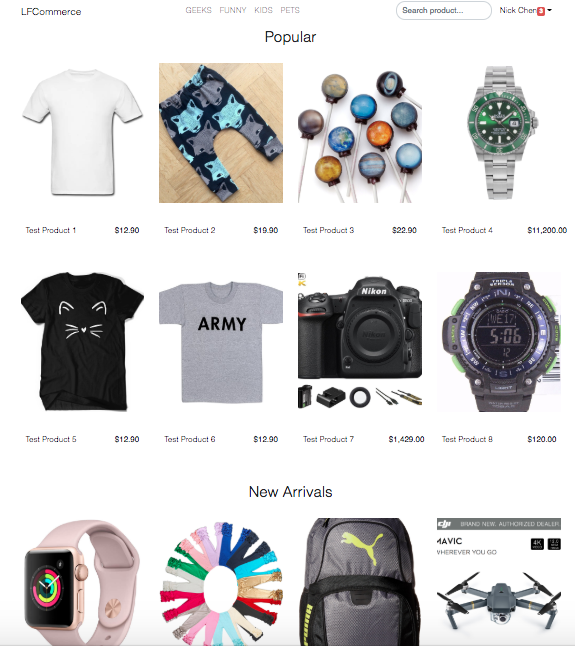

# LF Commerce

<p>
  
  
  
  
</p>

The goal of this project is to develop an open source ecommerce system written in ReactJS + ExpressJS. LF Commerce will provide a Plug-And-Play experience to users with minimal programming background. 

## Development plan for next 2 weeks

- Order Listing components (Admin dashboard)
- Customer Listing components (Admin dashboard)
- Product Listing components (Admin dashboard)
- Authentication API (ExpressJS)
- TBC





## Installation

**Yarn**
```console
yarn install
```

**NPM**

```console
npm install
```


## How to run this?

**Yarn**

```console
yarn start
```

**NPM**

```console
npm start
```

## Unit Test

For every main directory (components, containers etc.), there should be a \_\_tests\_\_ directory for all unit test cases.
```console
yarn test [test_directory]
```


## How to contribute to this project?

Your contribution is appreicated. For the purpose of having good project management, I encourage you to understand the project structure and *way of working* before you start to contribute to this project.

```
.
├── build                    # React Front-end build directory
├── docs                     # Static files for Github page, https://ccwukong.github.io/lfcommerce
├── public                   # Static public assets and uploads
├── routes                   # The endpoints/routes of ExpressJS
├── src                      # ReactJS source code
│   ├── actions              # Actions and Action creators of Redux
│   ├── apis                 # Files for REST APIs
│   │   ├── mocks            # Mocked API response
│   ├── components           # React components
│   |   ├── __tests__        # Unit test for components
│   |   ├── admin            # React components for admin dashboard
│   ├── containers           # React containers
│   |   ├── __tests__        # Unit test for containers
│   |   ├── admin            # React container components for admin dashboard
│   ├── reducers             # React containers
│   |   ├── __tests__        # Unit test for reducers
│   |   ├── cart             # Reducers for cart components
│   |   ├── products         # Reducers for product components
│   ├── sagas                # Redux saga files
│   |   ├── __tests__        # Unit test for sagas
│   ├── translations         # All language translation .json files
│   └── App.css              # Your customized styles should be added here
│   └── App.js               # ** Where React webapp routes configured.
│   └── index.js             # React webapp start point
└── .travis.yml              # Travis CI config file
└── .eslintrc.json           # **Don't change settings here.
└── package.json             # All project dependancies
└── app.js                   # Server application start point
└── README.md                # **Don't change contents here.
```

### 1. Always work on your own feature or bugfix branch.

You will need to follow the naming convention if it's a new feature:
**feature/xxx-xxx-xx**

or **bugfix/xxx-xxx-xx** if it's a bug fixing branch.

### 2. Always send your PR to **master** branch.

You should always BRANCH OUT from **master** branch and send PR back to **master** when it's ready for review.

### 3. Always run eslint

Before creating a PR, you should run:
```console
yarn eslint
```
to make sure all formatting or other issues have been properly fixed.

...
TBC

## License
LF Commerce is [Apache-2.0 licensed.](https://github.com/ccwukong/lfcommerce/blob/master/LICENSE)
